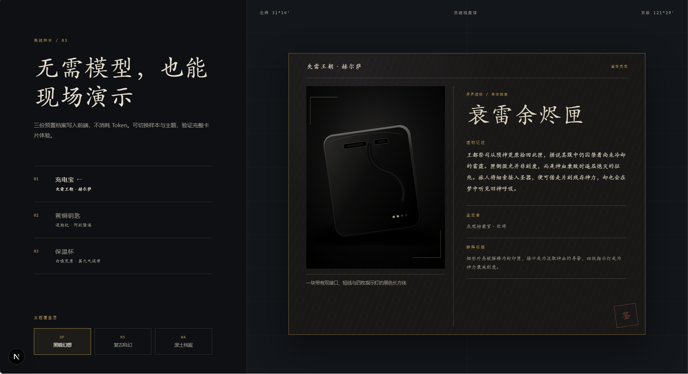
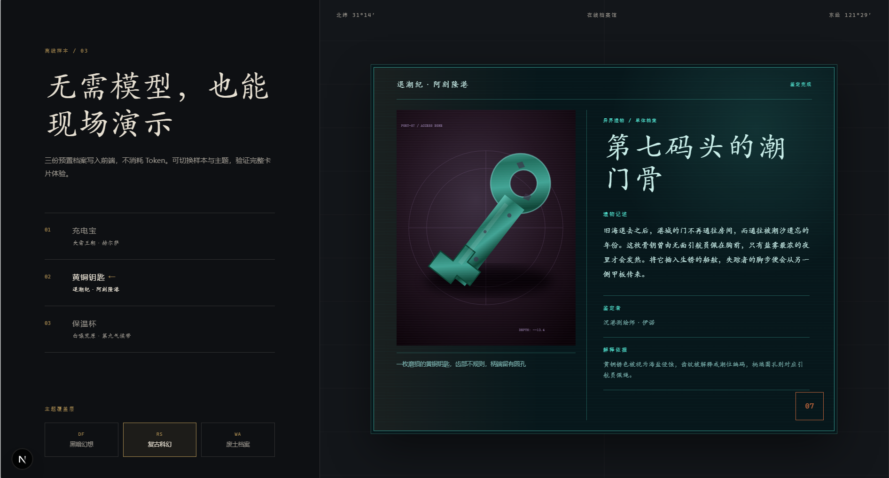
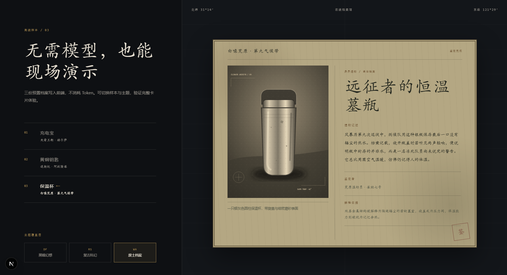

<p align="center">
</p>

<h1 align="center">异界遗物局</h1>

<p align="center"><strong>Museum of Other Worlds</strong></p>

<p align="center">
  将现实中的日常物品，鉴定为原创异世界遗物。
</p>

<p align="center">
  <a href="#-5-分钟启动">快速开始</a> ·
  <a href="#-主题档案画廊">主题画廊</a> ·
  <a href="#-核心体验">核心体验</a> ·
  <a href="./docs/PROVIDERS.md">模型接入</a> ·
  <a href="./docs/DEPLOYMENT.md">部署说明</a>
</p>

<p align="center">
  
  
  
  
</p>

> 为「外滩 AI 黑客松」打造的 AI 图片理解与互动叙事应用。上传一件现实物品、给出一句世界观，让它在另一个世界获得来历。

## ✦ 核心体验

```text
现实物品照片  +  自定义世界观  →  原创遗物档案卡
```

用户无需注册。选择或新建一个世界观，上传照片，点击“开始鉴定”，即可得到一张包含以下内容的游戏式遗物卡：

- 原创遗物名称与世界名称
- 80–180 字的世界观内物品说明
- 原创鉴定者身份
- 现实外观如何被“异文明”解释的证据
- 原始照片、纹理、印章、装饰边框与主题化视觉效果

一块普通的充电宝，可以被解释为封存旧神雷霆的残缺圣物；接口、指示灯与外壳磨损，都会成为异文明档案中的证据。

## ◈ 主题档案画廊

<p align="center">
  
  
</p>

<p align="center">
  
</p>

| 主题 | 视觉语言 | 展示重点 |
| --- | --- | --- |
| 黑暗幻想 | 石刻、旧金、宗教遗迹与衰败文明 | 神话遗物感 |
| 复古科幻 | 模拟仪表、扫描线、琥珀与青绿辉光 | 异界技术档案 |
| 废土档案 | 锈蚀金属、纸质标签、编号与封签 | 灾后机构记录 |

主题切换只改变视觉表达，**不会重复调用模型**。

## ⟡ 为什么不是普通的 AI 故事生成器？

| 设计 | 意义 |
| --- | --- |
| **视觉证据驱动** | 不只给物品改名，还解释形状、材质、接口、光源与磨损如何被异世界重新理解。 |
| **异文明误读** | 将轻微的视觉误识别转化为设定：它可以是鉴定者的局限，而非纯粹的失败。 |
| **内容与视觉解耦** | 一次结构化鉴定，可以即时切换多套主题，降低调用成本并方便持续扩展。 |
| **原创边界** | 不复刻现有游戏或影视 IP；只抽取抽象叙事气质，生成原创世界、角色、阵营与专有名词。 |
| **现场可靠性** | 3 个离线 Demo、Mock Provider 与一次结构修复重试，保证 API 波动时仍可完整展示。 |

## ⚙ 技术架构

```text
浏览器
├─ React 创建工作台
├─ Dexie / IndexedDB 世界观库（最多 5 条）
└─ html-to-image：2× PNG 导出
          │
          ▼
Next.js Route Handlers
├─ AIProvider
│  ├─ Mock Provider
│  └─ OpenAI-compatible HTTP Provider
└─ ObjectStorage
   ├─ Local filesystem
   └─ S3-compatible storage
          │
          ▼
公开只读页 /artifact/{id}
```

| 层级 | 选型 |
| --- | --- |
| 应用 | Next.js App Router、React、TypeScript、Tailwind CSS |
| 数据校验 | Zod |
| 本地世界观 | Dexie / IndexedDB，故障时内存降级 |
| 图片处理 | Sharp、html-to-image |
| 测试 | Vitest、Testing Library、Playwright |
| 存储 | 本地文件系统或 S3-compatible 对象存储 |

业务组件不依赖任意特定模型厂商 SDK。通过环境变量即可在 Mock 模式和 OpenAI 风格接口之间切换，便于适配不同赛道要求。

## 🚀 5 分钟启动

**前置条件：Node.js 22 LTS、npm 10、Git。**

```powershell
git clone https://github.com/tail258/museum-of-other-worlds.git
Set-Location museum-of-other-worlds
Copy-Item .env.example .env.local
npm ci
npm run dev
```

访问 [http://localhost:3000](http://localhost:3000)。默认 `.env.example` 为：

```dotenv
AI_PROVIDER=mock
STORAGE_PROVIDER=local
```

无需 API Key，即可演示上传、鉴定、主题切换、PNG 导出与发布流程。

### 使用真实模型

```dotenv
AI_PROVIDER=openai-compatible
AI_BASE_URL=https://your-provider.example/v1
AI_API_KEY=replace-me
AI_VISION_MODEL=your-vision-model
AI_TEXT_MODEL=your-text-model
```

接口要求兼容 `POST /chat/completions`，支持图片 data URL 和 JSON 对象输出。完整 Provider 契约见 [docs/PROVIDERS.md](./docs/PROVIDERS.md)。密钥只应存在于服务端环境变量中，不要使用 `NEXT_PUBLIC_` 前缀。

## 🧪 质量状态

- ESLint：通过
- TypeScript 类型检查：通过
- 单元与组件测试：47 项通过
- Chromium 端到端测试：3 项通过
- 生产构建：通过
- 生产依赖审计：0 个已知漏洞
- 语句覆盖率：82.35%
- 已验证桌面端与 390×844 移动端的核心体验

```powershell
npm run lint
npm run typecheck
npm test
npm run test:e2e
npm run build
```

## ☁ 部署准备

项目已完成部署准备，但**尚未绑定云账号、模型凭据或公网域名**。

- 支持 Vercel、Node 容器平台及其他支持 Next.js Node.js Runtime 的环境。
- 公网环境建议使用 S3-compatible 对象存储。
- 用户只在主动点击“发布分享”时上传源图与作品 JSON。
- 完整部署流程与平台限制见 [docs/DEPLOYMENT.md](./docs/DEPLOYMENT.md)。

## 🗂 项目结构

```text
src/app/                 页面与 Route Handlers
src/components/          遗物卡、创建台、Demo、世界观 UI
src/features/providers/  模型 Provider 与重试编排
src/features/storage/    本地 / S3 对象存储适配
src/features/worlds/     IndexedDB 与内存降级
tests/                   单元、组件与 E2E 测试
public/demos/            第一方 SVG Demo 素材
docs/                    Provider、部署与 README 展示素材
```

## 📜 许可证与素材

本项目采用 [GNU Affero General Public License v3.0 或更高版本](./LICENSE) 发布。

- README 中的三张主题截图为项目 UI 实机截图，由仓库维护者提供并随项目源码一同发布。
- 视觉纹理、边框和 Demo SVG 均为第一方素材。
- 不提交第三方字体文件，不使用 AI 生成图片作为遗物卡内容。
- 依赖许可清单见 [THIRD_PARTY_ASSETS.md](./THIRD_PARTY_ASSETS.md)。

---

<p align="center">让现实物品，在另一个世界获得来历。</p>
